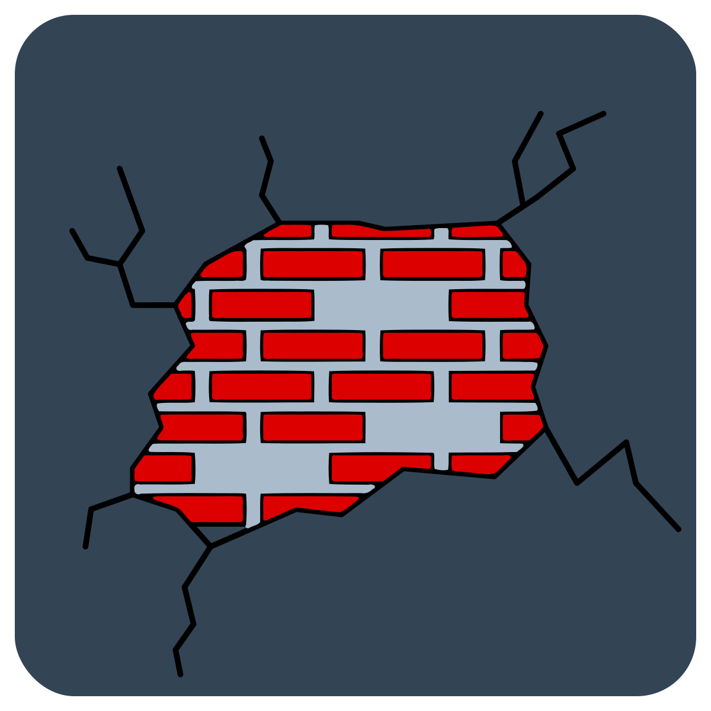

# Ruptura

    

    <strong>
        A Windows DLL injection, function interception, and memory manipulation
        library for .NET.
    </strong>

---

**Ruptura** provides a set of libraries that make it easy to inject a managed
.NET assembly into arbitrary Windows processes for the purposes of function
hooking and memory manipulation.

**Ruptura** injects a bundled native module into the target process, which then
locates the .NET runtime in either framework-dependent or self-contained mode
and initializes it, after which a user-specified managed assembly is executed -
all without the user writing a single line of native code. Additionally, a
library facilitating common function hooking and memory manipulation scenarios
is available for use by the injected assembly.

## Usage

This project offers the following packages:

| Package | Description | Downloads |
| -: | - | :- |
| [![Vezel.Ruptura.Injection][injection-img]][injection-pkg] | Provides the infrastructure to inject the .NET runtime and assemblies into processes. | ![Downloads][injection-dls] |
| [![Vezel.Ruptura.Hosting][hosting-img]][hosting-pkg] | Provides the hosting model for injected programs. | ![Downloads][hosting-dls] |
| [![Vezel.Ruptura.Memory][memory-img]][memory-pkg] | Provides function hooking, memory manipulation, and call tracing utilities. | ![Downloads][memory-dls] |
| [![Vezel.Ruptura.System][system-img]][system-pkg] | Provides lightweight managed wrappers around operating system objects such as processes and threads. | ![Downloads][system-dls] |

[injection-pkg]: https://www.nuget.org/packages/Vezel.Ruptura.Injection
[hosting-pkg]: https://www.nuget.org/packages/Vezel.Ruptura.Hosting
[memory-pkg]: https://www.nuget.org/packages/Vezel.Ruptura.Memory
[system-pkg]: https://www.nuget.org/packages/Vezel.Ruptura.System

[injection-img]: https://img.shields.io/nuget/v/Vezel.Ruptura.Injection?label=Vezel.Ruptura.Injection
[hosting-img]: https://img.shields.io/nuget/v/Vezel.Ruptura.Hosting?label=Vezel.Ruptura.Hosting
[memory-img]: https://img.shields.io/nuget/v/Vezel.Ruptura.Memory?label=Vezel.Ruptura.Memory
[system-img]: https://img.shields.io/nuget/v/Vezel.Ruptura.System?label=Vezel.Ruptura.System

[injection-dls]: https://img.shields.io/nuget/dt/Vezel.Ruptura.Injection?label=
[hosting-dls]: https://img.shields.io/nuget/dt/Vezel.Ruptura.Hosting?label=
[memory-dls]: https://img.shields.io/nuget/dt/Vezel.Ruptura.Memory?label=
[system-dls]: https://img.shields.io/nuget/dt/Vezel.Ruptura.System?label=

To install a package, run `dotnet add package <name>`.

See the [sample programs](src/samples) for examples of what the API can do. The
samples can be run with
[`dotnet example`](https://github.com/patriksvensson/dotnet-example).

For more information, please visit the
[project home page](https://docs.vezel.dev/ruptura).

## License

This project is licensed under the terms found in
[`LICENSE-0BSD`](LICENSE-0BSD).
